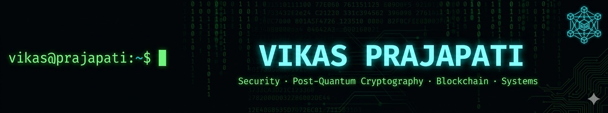

<p align="center">
  
</p>

<div align="center">
  
</div>

## 👨‍💻 whoami

<table>
<tr>
<td valign="top" width="50%">

```bash
vikas@prajapati:~$ cat profile.json
```

```json
{
  "name"      : "Vikas Prajapati",
  "education" : "IIT Jammu, CS '26",
  "intern"    : "Tuning Bill, Jaipur",
  "location"  : "Jaipur, Rajasthan, IN",
  "focus"     : [
    "Security",
    "Post-Quantum Cryptography",
    "Blockchain & MPC"
  ],
  "btp"       : "Quantum-Safe Video Conferencing",
  "cp"        : {
    "codeforces" : "Vikas_Prajapati",
    "leetcode"   : "Vikas_Prajapati04"
  }
}
```

</td>
<td valign="top" width="50%">

```bash
vikas@prajapati:~$ cat current_work.txt
```

```

🔐 BTP: Quantum-safe video conferencing
        → Kyber + Dilithium + GStreamer

💼 Intern @ Tuning Bill, Jaipur
        → Blockchain, Cold Storage & MPC

🛡️  Pentest & Web Security Research
        → XSS, SQLi, CSRF, SSRF

🌱 Exploring: Cold Storage in Blockchain
        → MPC (Multi-Party Computation)
        → Multi-Signature Schemes
        → Smart Contract Security


```

</td>
</tr>
</table>

## 🛠️ Technology Arsenal

<div align="center">

### Languages
<p align="center">
  
</p>

### Security & Cryptography
<p align="center">
  
  
  
  
  
  
  
  
  
</p>

### Systems & Infrastructure
<p align="center">
  
</p>

### Web & Frameworks
<p align="center">
  
</p>

### Developer Tools
<p align="center">
  
</p>

</div>

---

## 🚀 Featured Projects

<div align="center">
<table>
<tr>

<td width="50%" valign="top">

### 🔐 Quantum-Secure Video Conferencing
> *B.Tech Project (BTP) — Post-Quantum Cryptography*

Quantum-resistant real-time video conferencing using NIST-standardized PQC algorithms. Kyber-768 for key exchange, Dilithium2 for signatures, AES-256 over SRTP for media — <1ms crypto overhead at 30 FPS.


-00D9FF?style=flat-square)
-8A2BE2?style=flat-square)

[](https://github.com/Vikas2171/Quantum_Secure_Video_Conference_App_V3)

</td>

<td width="50%" valign="top">

### 🕷️ Vulnerable Web Application
> *Cybersecurity — Offensive Security Practice · ⚠️ Educational Use Only*

Intentionally vulnerable web app covering 7 OWASP attack vectors — built for penetration testing practice and security awareness training. Full login system with exploitable endpoints for each vulnerability.


[](https://github.com/Vikas2171/vulnerable-website)

</td>
</tr>
<tr>

<td width="50%" valign="top">

### 📡 Packet Sniffer & Analyzer
> *Networking — Low-Level Systems Programming in C*

Wireshark-inspired CLI tool that captures and dissects live network traffic in real time. Parses Ethernet, IP, TCP, UDP, ARP, and ICMP headers with field-level human-readable output.


[](https://github.com/Vikas2171/packet-sniffer)

</td>

<td width="50%" valign="top">

### 🌐 Interactive Terminal Portfolio
> *Web Development — Serverless Architecture*

A portfolio that looks and works like a real terminal CLI. Type `about`, `projects`, `skills` to navigate. Features live CP stats fetched via Netlify Functions, a browser-based Cipher Machine, and a secure contact form — zero backend servers.


[](https://vikas-porfolio.netlify.app/)
[](https://github.com/Vikas2171/my-portfolio)

</td>
</tr>
</table>
</div>

---

## 💼 Professional Experience

<div align="center">

### 🔒 Software Engineer Intern
**`Fintech Startup · Jaipur, India · 2026–Present`**

</div>

<table>
<tr>

<td width="50%" valign="top">

### 🏛️ Blockchain Asset Registry & Trade Platform
> *Distributed Ledger · Smart Contracts*

A permissioned blockchain platform for registering and trading real-world assets. Built on a private multi-node blockchain with QBFT consensus — supports asset tokenization, ownership transfer, and trade lifecycle management via smart contracts.


```
🔐 Private blockchain — 5-6 node QBFT network
📜 Smart contracts for asset tokenization & trade
🔗 Full asset lifecycle: register → trade → transfer
```


</td>

<td width="50%" valign="top">

### 🔑 MPC Wallet — Split-Key Architecture
> *Cryptography · Cold Storage · Key Management*

A threshold-based crypto wallet splitting the private key between a hot machine and a cold machine using MPC. Neither machine alone can sign a transaction — both must participate, ensuring the full key never exists in one place.


-00FF41?style=flat-square)


```
🔑 Private key split: hot machine + cold machine
✍️  MPC-based signing — key never fully reconstructed
💸 POL token transfers on Polygon testnet
```


</td>
</tr>
</table>

---

## 📊 GitHub Stats

<div align="center">


</div>

<div align="center">


</div>

<div align="center">


</div>

---

## 🌐 Let's Connect

<div align="center">

[](https://www.linkedin.com/in/vikas-prajapati-577bab252/)
[](https://github.com/Vikas2171)
[](https://vikas-porfolio.netlify.app/)
[](https://codeforces.com/profile/Vikas_Prajapati)
[](https://leetcode.com/u/Vikas_Prajapati04/)

</div>


---

<div align="center">

### 💭 *"Security is not a product, but a process."*
#### *— Bruce Schneier*

<br/>


<br/>

**Thanks for visiting! Feel free to explore, fork, and collaborate.** 🔐


</div>
